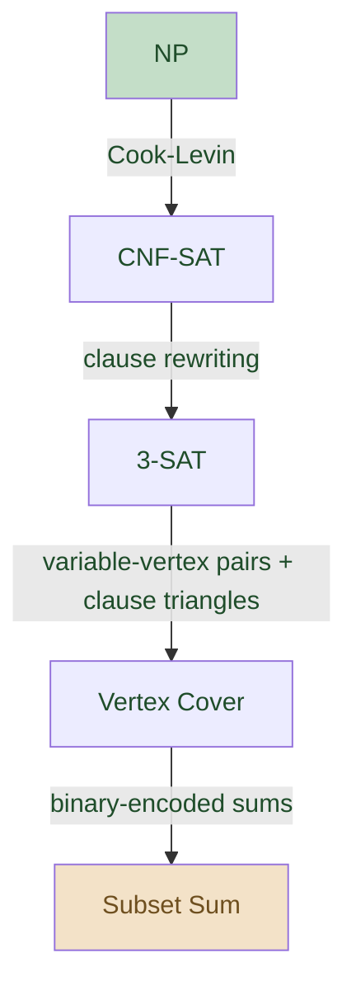

# Topic 4 — Complexity and NP-Completeness

**Lectures:** L7 (Problems we think we can't solve: the class NP) + L8 (NP-hardness and reductions) — David Mestel
**Reference:** `Materials/02 Lecture Slides/2026-lecture -complexity.pdf`, `2026-npcompleteness.pdf`, `complexity-notes.pdf`

---

## What the Exam Asks

From the 2024 final, Q4 is split between this topic and Linear Programming (~17 pts of the 28 are NP-related):

- **(a) [5 pts]** Formulate the optimisation problem as a **decision problem** (INPUT / OUTPUT format).
- **(b) [2 pts]** State the **two conditions** required for a decision problem to be NP-complete.
- **(c) [10 pts]** Show that the decision problem is **NP-complete**, usually via a **reduction from a known NPC problem** (the question typically gives a hint, e.g. "use a reduction from Knapsack").

> Strategy: memorise the reduction structure. Most exam reductions are from Knapsack, Subset-Sum, or 3-SAT.

---

## Decision Problems and Languages

A **decision problem** has answer YES or NO. Most optimisation problems can be converted:

- Optimisation: "find the shortest Hamiltonian cycle in $G$."
- Decision: "given $G$ and integer $T$, does $G$ have a Hamiltonian cycle of weight $\leq T$?"

A **language** $L$ is a set of strings — exactly the strings encoding YES instances. So "is $l \in L$?" is the decision problem.

> **Why decision and not optimisation?** Uniformity — we can talk about classes (P, NP, NPC) cleanly. Also, decision and optimisation are roughly equivalent in complexity (binary-search the optimisation version using the decision oracle).

---

## The Class P

**Definition.** A language $L \in \mathsf{P}$ iff there exists an algorithm $A$ and a polynomial $p$ such that:

- $A$ decides membership in $L$: on input $l$, $A$ outputs YES iff $l \in L$.
- $A$ runs in polynomial time: on input $l$, $A$ runs in time $\leq p(|l|)$.
- $A$ is **deterministic** (no randomness).

**Showing $L \in \mathsf{P}$:**

- **Option 1: write the algorithm.** Mergesort, Dijkstra, Floyd-Warshall, LCS, etc.
- **Option 2: reduce $L$ to a known P language.** A poly-time reduction $L_1 \to L_2$ plus $L_2 \in \mathsf{P}$ implies $L_1 \in \mathsf{P}$.

**Reductions (polynomial-time Karp reduction):** a poly-time computable function $f$ mapping instances of $L_1$ to instances of $L_2$ such that $l \in L_1 \Leftrightarrow f(l) \in L_2$. Notation: $L_1 \to L_2$.

> "Use for good": $L_2 \in \mathsf{P} \Rightarrow L_1 \in \mathsf{P}$ (we get an algorithm for $L_1$ via $f$).
> "Use for evil": $L_1$ hard $\Rightarrow L_2$ hard.

---

## The Class NP

**Definition (verifier-based).** A language $L \in \mathsf{NP}$ iff there's a verification algorithm $B$ and a polynomial $p$ such that:

- $B$ takes input pairs $(x, y)$ where $x$ is an instance and $y$ is a **certificate** (witness).
- $B$ is deterministic polynomial-time.
- **Sound:** if $x \not\in L$, then no $y$ will convince $B$ ($B$ outputs NO on any $(x, y)$).
- **Complete:** if $x \in L$, there exists a polynomial-size certificate $y$ (with $|y| \leq q(|x|)$ for some polynomial $q$) such that $B$ outputs YES on $(x, y)$.

> **Key asymmetry.** NP treats YES and NO very differently. The certificate witnesses YES; verifying NO might require ranging over all possible certificates.

**Examples:**

- **TSP $\in \mathsf{NP}$.** Certificate = a Hamiltonian cycle. Verifier: check it visits all vertices and has weight $\leq T$.
- **CNF-SAT $\in \mathsf{NP}$.** Certificate = an assignment. Verifier: plug in and check the formula is true.
- **Factoring (decision form) $\in \mathsf{NP}$.** Question "does $n$ have a factor $\leq k$?". Certificate = a factor $l \leq k$. Verifier: check $l \leq k$ and $l$ divides $n$.

**Showing $L \in \mathsf{NP}$:** describe a certificate and a poly-time verifier. Almost every "natural" decision problem is in NP — the hard part is showing it's hard.

---

## P vs NP

The **million-dollar question:** can every problem whose YES-answers can be efficiently **checked** also be efficiently **solved**?

- If $\mathsf{P} = \mathsf{NP}$, every NP problem is in P (and so is NP-complete trivially).
- Most computer scientists believe $\mathsf{P} \neq \mathsf{NP}$.

**Other classes (informal):**

- **coNP** — NO answers can be efficiently checked. Conjecturally $\mathsf{P} \subset \mathsf{NP} \cap \mathsf{coNP}$, $\mathsf{NP} \neq \mathsf{coNP}$.
- **PSPACE** — solvable in polynomial space. Contains P, NP, coNP.

---

## NP-Hardness, NP-Completeness, Reductions

**$L$ is NP-hard:** for every problem $M \in \mathsf{NP}$, there's a polynomial-time reduction $M \to L$. (Equivalently: $L$ is at least as hard as everything in NP.)

**$L$ is NP-complete:** $L$ is NP-hard AND $L \in \mathsf{NP}$. ("Hardest problems in NP.")

**Two essential conditions.** To prove $L$ is NP-complete you must show:

1. **$L \in \mathsf{NP}$.** Describe certificate + verifier.
2. **$L$ is NP-hard.** Reduce from a known NP-hard problem.

> Why this works: if $L_1$ is NP-hard and we have a reduction $L_1 \to L_2$, then for any $M \in \mathsf{NP}$: $M \to L_1 \to L_2$, so $M$ reduces to $L_2$, so $L_2$ is also NP-hard.

**Cook-Levin Theorem.** CNF-SAT is NP-complete. This is the **first** NP-completeness result, proven by encoding any NP verifier as a Boolean formula. Once we have one NP-complete problem, we can prove others NP-complete by reducing **from** it.

---

## The Canonical NP-Completeness Chain (from lecture)

In practice, exam reductions usually start from **Knapsack** or **Subset-Sum** because those are easiest to map to "selection with budget" problems.

---

## Common NP-Complete Problems (Know These)

| Problem | Input | Decision question |
|---|---|---|
| **CNF-SAT** | Boolean formula $\varphi$ in CNF | Is $\varphi$ satisfiable? |
| **3-SAT** | CNF formula with 3 vars per clause | Is $\varphi$ satisfiable? |
| **Vertex Cover** | Graph $G$, integer $k$ | Does $G$ have a vertex cover of size $k$? (set $X$ of $k$ vertices touching every edge) |
| **Independent Set** | Graph $G$, integer $k$ | Does $G$ have an independent set of size $k$? ($k$ vertices, no edges between them) |
| **Clique** | Graph $G$, integer $k$ | Does $G$ have a $k$-clique? ($k$ mutually adjacent vertices) |
| **3-Colouring** | Graph $G$ | Can $G$ be 3-coloured? (no adjacent same colour) |
| **Hamiltonian Cycle** | Graph $G$ | Does $G$ have a Hamiltonian cycle? |
| **TSP** | Weighted graph $G$, integer $k$ | Does $G$ have a Hamiltonian cycle of weight $\leq k$? |
| **Subset Sum** | Multiset $S$ of integers, integer $k$ | Does $S$ have a subset summing to $k$? |
| **Knapsack** | Capacity $C$, weights $w_i$, values $v_i$, target $V$ | Subset with weight $\leq C$ and value $\geq V$? |

> **Independent Set $\Leftrightarrow$ Clique:** they're complementary. Reduction: $G$ has $k$-clique iff complement of $G$ has $k$-independent-set.

---

## Reduction Structure — Memorise This Template

To show "decision problem $L_2$ is NP-complete":

> **Step 1: $L_2 \in \mathsf{NP}$.**
> Certificate: a [thing that, if it exists, makes $L_2$ a YES].
> Verifier: in polynomial time, check that [thing satisfies the requirements of $L_2$].
> Conclude: $L_2 \in \mathsf{NP}$.
>
> **Step 2: $L_2$ is NP-hard.**
> We reduce from [known NPC problem $L_1$]. Given an instance $l$ of $L_1$, define $f(l)$ — an instance of $L_2$ — as follows:
> [explicit construction — assign vertices, edges, weights, target, etc., based on $l$].
>
> **$f$ is polynomial-time:** the construction takes [polynomial] time and produces [polynomial-size] output.
>
> **$f$ preserves YES / NO** ($l \in L_1 \Leftrightarrow f(l) \in L_2$):
>
> - **($\Rightarrow$) If $l$ is YES for $L_1$,** [take $L_1$'s certificate, transform it into an $L_2$ certificate that satisfies the $f(l)$ requirements]. Hence $f(l)$ is YES.
> - **($\Leftarrow$) If $f(l)$ is YES for $L_2$,** [take $f(l)$'s certificate, transform it back into an $L_1$ certificate]. Hence $l$ is YES for $L_1$.
>
> Conclude: $L_2$ is NP-hard.
>
> Since $L_2$ is in NP and NP-hard, $L_2$ is NP-complete. $\blacksquare$

### Worked example — Shortest Common Supersequence reduces to LCS (showing SCS $\in$ P)

A clean example of using reduction "for good" — showing membership in P by reducing to a known easy problem. From the lecture's complexity notes.

**SCS (decision version).** Input: strings $s_1$, $s_2$, integer $k$. Output: YES iff there exists a string $t$ with $|t| \leq k$ such that $s_1$, $s_2$ are both **subsequences** of $t$.

**Reduction $\text{SCS} \to \text{LCS}$.** Given an SCS instance $(s_1, s_2, k)$, produce an LCS instance:

$$f(s_1, s_2, k) = (s_1, s_2, |s_1| + |s_2| - k)$$

**Correctness uses the identity** $|\text{SCS}(s_1, s_2)| = |s_1| + |s_2| - |\text{LCS}(s_1, s_2)|$:

- Any supersequence $t$ must contain $s_1$ and $s_2$, sharing only the LCS as overlap.
- Picture: superimpose $s_1$ and $s_2$ on $t$; the shared characters form a common subsequence.

So:

$$\text{SCS has solution of size} \leq k \;\Leftrightarrow\; |s_1| + |s_2| - \text{LCS} \leq k \;\Leftrightarrow\; \text{LCS} \geq |s_1| + |s_2| - k$$

This is exactly the LCS decision problem on $f(s_1, s_2, k)$. Since LCS is in P (DP, $O(nm)$), so is SCS.

> **Use this template for "show $L \in \mathsf{P}$":** reduce $L$ to a known P problem (LCS, MST, shortest path, sort, etc.) and quote the latter's algorithm.

### Worked example — Mock Q4(c): Road-upgrade problem reduces from Knapsack

The 2024 exam problem (decreed messengers fanning out from Imperial Capital). Reduction from 0/1 Knapsack:

Given a Knapsack instance: $o$ objects with weights $w_i$ and values $v_i$, capacity $C$, target $V$.

Construct the Roads instance:

- $n = o + 1$ towns.
- Roads: road $i$ connects town $i$ to town $i + 1$ (line graph).
- Road $i$ has cost $c_i = w_i$ and travel time $b_i = 2 v_i$.
- One Noble at town $N_1 = o + 1$.
- Budget $B = C$.
- Target time $T = \left(\sum_i 2 v_i\right) - V$.

Then upgrading road $i$ halves its time (so saves $v_i$). Total time $= \left(\sum_i 2 v_i\right) - \left(\sum_{i \in S} v_i\right)$. The cost of upgrading set $S$ is $\sum_{i \in S} w_i$.

So Roads is YES $\Leftrightarrow \exists\, S$ with cost $\leq B$ and time saved $\geq V$ $\Leftrightarrow$ Knapsack is YES.

---

## Important Reduction Examples (Lecture)

### Reducing CNF-SAT to 3-SAT

Given a CNF clause:

- $a_1 \lor a_2 \lor a_3 \to$ already 3-SAT.
- $a_1 \lor a_2 \to (a_1 \lor a_2 \lor b) \land (a_1 \lor a_2 \lor \lnot b)$ — new variable $b$; both forced clauses satisfied iff $a_1 \lor a_2$.
- $a_1 \to (a_1 \lor b_1 \lor b_2) \land (a_1 \lor b_1 \lor \lnot b_2) \land (a_1 \lor \lnot b_1 \lor b_2) \land (a_1 \lor \lnot b_1 \lor \lnot b_2)$ — covers all $b_1, b_2$ combinations.
- $a_1 \lor a_2 \lor \ldots \lor a_k$ for $k > 3$: $(a_1 \lor a_2 \lor b_1) \land (\lnot b_1 \lor a_3 \lor b_2) \land (\lnot b_2 \lor a_4 \lor b_3) \land \ldots \land (\lnot b_{k-3} \lor a_{k-1} \lor a_k)$.

### Reducing 3-SAT to Vertex Cover

For formula $\varphi$ with $m$ variables and $n$ clauses:

- For each variable $x_i$: add two vertices $x_i$ and $\lnot x_i$ with an edge between them. (Cover must include one of each pair.)
- For each clause (the $j$th clause $a_{j,1} \lor a_{j,2} \lor a_{j,3}$): add a triangle of three vertices $j_1, j_2, j_3$. (Cover must include 2 of each triangle.)
- Cross-edges: connect $j_1$ to the vertex labelled $a_{j,1}$, and likewise for $j_2, j_3$.

Set $k = m + 2n$. Then $G$ has a $k$-vertex cover $\Leftrightarrow \varphi$ is satisfiable.

### Reducing Vertex Cover to Subset Sum

Use a base-4 encoding so different powers don't interact. For each vertex $i$, integer $a_i$ has a high-order $4^{m+1}$ (to force exactly $k_1$ vertices) plus a $4^j$ for each edge $j$ incident to vertex $i$. For each edge $j$, an auxiliary $b_j = 4^j$. Target: $k_1 \cdot 4^{m+1} + \sum_j 2 \cdot 4^j$.

---

## Standard Conceptual Questions and Answers

### "What is a decision problem?"

A computational problem whose answer is YES or NO. Equivalently, a language (set of YES-strings).

### "What's the difference between NP-hard and NP-complete?"

NP-hard = "at least as hard as everything in NP" (could be even harder, e.g. the halting problem). NP-complete = NP-hard AND in NP (the hardest problems **inside** NP).

### "How can a problem be NP-hard but not in NP?"

E.g. counting problems ("how many satisfying assignments?") or problems beyond NP (e.g. PSPACE-complete games). The decision version might not have polynomial-size certificates.

### "Why isn't Knapsack in P even though we have an $O(nW)$ DP?"

Because input size is $O(n \log W)$, not $O(n + W)$. The DP runtime is polynomial in $W$ (i.e. in $2^{\text{input size}}$) — that's **pseudopolynomial**, not polynomial.

### "If $\mathsf{P} = \mathsf{NP}$, what happens?"

Every NP problem (SAT, TSP, Knapsack, etc.) becomes solvable in polynomial time. Public-key cryptography breaks. Almost certainly false but unproven.

---

## Quick Reference

| Concept | Definition |
|---|---|
| **P** | Decided in polynomial time (deterministic) |
| **NP** | YES-certificates verifiable in polynomial time |
| **coNP** | NO-certificates verifiable in polynomial time |
| **NP-hard** | Every NP problem reduces to it |
| **NP-complete** | NP-hard AND in NP |
| **Karp reduction** | Poly-time function $f$ with $l \in L_1 \Leftrightarrow f(l) \in L_2$ |
| **Pseudopolynomial** | Polynomial in the *values* of inputs, exponential in the *bits* |

---

## Practice Problems

- 2024 mock Q4(a)–(c)
- Tutorial Week 4 (NP-hardness)
- Goodrich & Tamassia R-17.3, 17.4, 17.5, 17.9, C-17.9, 17.11, 17.12, 17.13, 17.17, A-17.2, 17.4, 17.5, 17.6
- CLRS 34.5-2, 34.5-3, 34.5-7, 34.5-8, 34-2, 34-3, 34-4

> **Friend's exam template:** "1) Certificate + verifier $\to$ in NP. 2) Reduce from Knapsack (or whatever the hint says). 3) Construct $f$ explicitly. 4) Prove iff both directions. Done."
