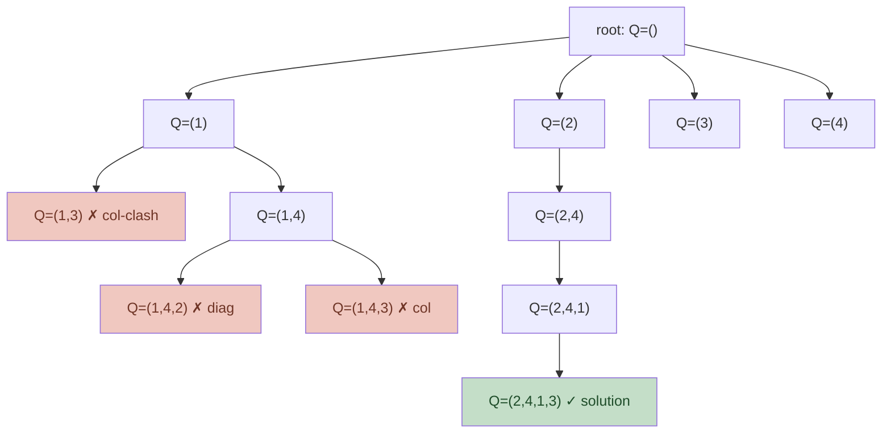

# Worked Examples — Backtracking & Branch-and-Bound

The six elements an exam answer must name:

1. **State representation** (what does a partial solution look like?)
2. **Candidate generation** (what choices extend the state?)
3. **Feasibility test** (when do we prune for infeasibility?)
4. **Recursive call** (the recursion shape)
5. **Base case** (when do we stop?)
6. **Search tree size** (worst-case complexity)

Branch-and-bound adds: **incumbent**, **bound function**, **pruning condition**.

---

## 1. N-Queens (Backtracking)

**State.** Array $Q[1..k]$ where $Q[r] = c$ means a queen at row `r`, column `c`. `k` is the next free row.

**Candidates.** For row `k`, try columns `1..n` not threatened by any already-placed queen.

**Feasibility.** A column `c` is feasible iff for all `i < k`: $Q[i] \neq c$, $|Q[i] - c| \neq k - i$.

```
N-QUEENS(k, n, Q, solutions):
    if k > n:
        solutions.append(copy(Q))
        return
    for c in 1..n:
        if FEASIBLE(Q, k, c):
            Q[k] = c
            N-QUEENS(k+1, n, Q, solutions)
        # implicit undo: next iteration overwrites Q[k]

FEASIBLE(Q, k, c):
    for i in 1..k-1:
        if Q[i] == c: return false
        if |Q[i] - c| == k - i: return false
    return true
```

**Search tree size.** Upper bound $n!$ (worst case), in practice much less due to pruning.

**Search tree (n=4 queens, partial expansion).**



---

## 2. Subset Sum (Decision, Backtracking)

**Input.** Set $\{a_1, \ldots, a_n\}$, target $T$.

**State.** Index `i` (next item to decide), `current_sum` so far.

**Candidates.** Include $a_i$ or skip.

**Feasibility.** Prune if `current_sum > T` (over) or `current_sum + remaining < T` (under).

```
SUBSET-SUM(A, T, i, sum, remaining):
    if sum == T: return true
    if sum > T or sum + remaining < T or i > n: return false
    # try include
    if SUBSET-SUM(A, T, i+1, sum + A[i], remaining - A[i]):
        return true
    # try skip
    return SUBSET-SUM(A, T, i+1, sum, remaining - A[i])
```

**Search tree size.** Up to $2^n$ leaves; pruning reduces typical size dramatically.

---

## 3. Graph Coloring (Backtracking)

**Goal.** Assign colors $1..k$ to vertices so that adjacent vertices differ.

**State.** Array $C[1..i-1]$ of colors assigned so far; `i` = next vertex.

**Candidates.** For vertex `i`, try colors `1..k`.

**Feasibility.** Color `c` is feasible for vertex `i` iff no neighbour `j < i` has $C[j] == c$.

```
COLOR(G, i, k, C):
    if i > n:
        return copy(C)   # success
    for c in 1..k:
        if no neighbour j < i with C[j] == c:
            C[i] = c
            result = COLOR(G, i+1, k, C)
            if result is not None: return result
    return None
```

---

## 4. 0/1 Knapsack — Branch-and-Bound

**Bound function.** Continuous (fractional) knapsack relaxation: at any node with remaining capacity $c$ and items in some order (by $v_i / w_i$ desc), the bound is $\text{current\_value} + \text{fractional fill of remaining}$.

**State.** `i` (next item), `taken_value`, `taken_weight`, `bound`.

**Pruning rule.** If $bound \leq incumbent$, prune.

```
KNAPSACK-BB(items, W):
    sort items by v_i/w_i desc
    Q = priority queue keyed by bound (max-heap)
    Q.push(root = {i=1, val=0, wt=0, bound=B(0,0,1)})
    best = 0
    while Q not empty:
        node = Q.pop()
        if node.bound <= best: continue   # PRUNE
        if node.i > n: continue
        # branch: include item i
        w_in = node.wt + w[i]; v_in = node.val + v[i]
        if w_in <= W and v_in > best: best = v_in
        if w_in <= W:
            Q.push({i+1, v_in, w_in, B(v_in, w_in, i+1)})
        # branch: skip item i
        Q.push({i+1, node.val, node.wt, B(node.val, node.wt, i+1)})
    return best

B(val, wt, i):
    # upper bound: pack remaining items fractionally
    cap = W - wt
    bound = val
    while i <= n and w[i] <= cap:
        bound += v[i]; cap -= w[i]; i += 1
    if i <= n: bound += v[i] * cap / w[i]
    return bound
```

**Why pruning preserves optimality.** The bound is an upper bound on any extension of the node. If it does not exceed the incumbent, no descendant can improve.

---

## 5. Travelling Salesman — Branch-and-Bound (Cheapest-First)

**State.** Current path `P`, length `len(P)`, set of unvisited vertices.

**Bound function.** `len(P) + minimum incoming/outgoing edge cost across each unvisited vertex + return-to-start lower bound`.

```
TSP-BB(G, start):
    incumbent = +infinity
    best_tour = None
    Q = priority queue
    Q.push({path=[start], len=0, visited={start}, bound=B0})
    while Q not empty:
        node = Q.pop()
        if node.bound >= incumbent: continue   # PRUNE
        if |node.visited| == n:
            tour_len = node.len + dist(node.path[-1], start)
            if tour_len < incumbent:
                incumbent = tour_len; best_tour = node.path + [start]
            continue
        for v not in node.visited:
            new_len = node.len + dist(node.path[-1], v)
            new_path = node.path + [v]
            new_bound = B(new_path, new_len, visited ∪ {v})
            if new_bound < incumbent:
                Q.push({new_path, new_len, visited ∪ {v}, new_bound})
    return best_tour, incumbent
```

---

## 6. Common Exam Mistakes

- Forgetting to **undo** state in the recursive call (only matters for shared mutable state; immutable / copy-on-call avoids this).
- Reporting the search-tree size as "$O(2^n)$" without saying it is **with pruning** typically much smaller.
- Mixing up **incumbent** (best feasible found so far) with **bound** (optimistic estimate of subtree). The pruning rule is `bound (relative direction) incumbent` — for max-problem, $bound \leq incumbent$ prunes; for min-problem, $bound \geq incumbent$ prunes.
